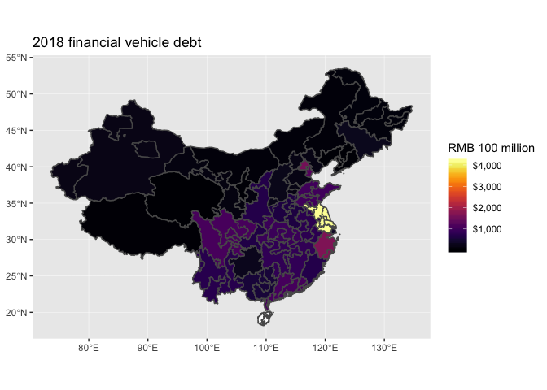
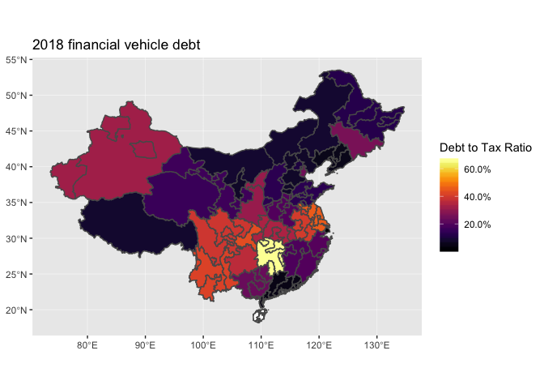
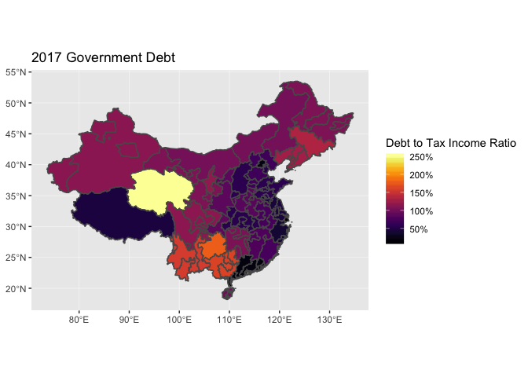
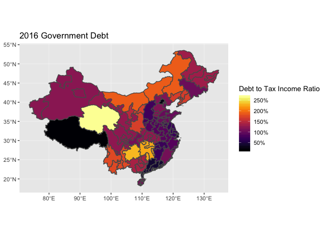
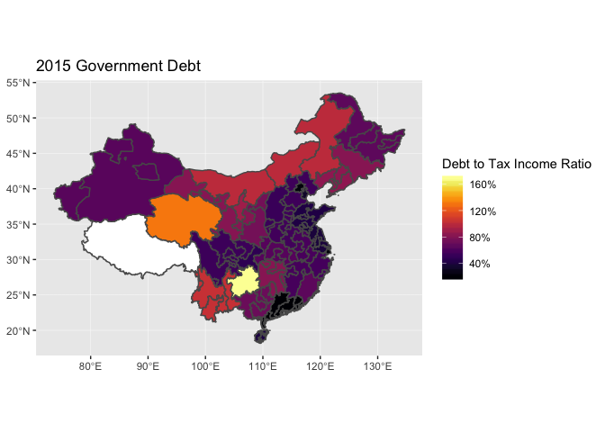

Chinese Local Debt
================
Po-Sheng Lee

-   [Data Processing](#data-processing)
-   [Top 10 Debt (to Tax) province from 2014 to 2017](#top-10-debt-to-tax-province-from-2014-to-2017)
-   [Mapping the Debt](#mapping-the-debt)
-   [Modeling the Debt](#modeling-the-debt)

Data Processing
===============

``` r
library(magrittr)
library(tidyverse) 
library(readr)
library(readxl)
library(lubridate)
library(Zelig)
library(plm)
library(sf)
library(leaflet)
library(viridis)


FinancialVehicleDebt <- read_excel("data/LocalGovernmentFinancialVehicleWIND.xlsx", 
    col_types = c("text", "text", "text", 
        "text", "numeric", "numeric", "numeric", 
        "numeric", "date", "numeric", 
        "numeric", "blank", "text", "text", 
        "text", "text", "blank", "blank", 
        "blank", "blank", "blank", "blank", "blank", "blank", 
        "blank", "blank", "blank", "blank", "blank", "blank", 
        "blank", "blank", "blank", "blank", "blank", "blank", 
        "blank"), skip = 1)

GovernmentDebt <- read_excel("data/LocalGovernmentDebt.xlsx", 
    col_types = c("text", "text", "text", 
        "text", "numeric", "numeric", "numeric", 
        "numeric", "date", "numeric", "numeric", 
        "text", "text", "blank", "blank"), 
    skip = 1)
```

``` r
FinancialVehicleDebt %<>%
  distinct(fullname, issueamount, issuerupdated, .keep_all = TRUE) %>%
  mutate(term = round(term*365/30, digits = 0)) %>%
  mutate(issue_date = maturitydate - months(term)) %>%
  mutate(issue_year = year(issue_date))

GovernmentDebt %<>%
  distinct(fullname, issueamount, issuerupdated, .keep_all = TRUE) %>%
  mutate(issue_date = maturitydate - years(term)) %>%
  mutate(issue_year = year(issue_date))
```

``` r
LGFV_industry <- FinancialVehicleDebt %>%
  filter(!is.na(abs_province) & !is.na(issue_year) & !is.na(abs_industry) == TRUE) %>%
  group_by(abs_province, issue_year, abs_industry) %>%
  summarise(FVdebt_issuance = sum(outstandingbalance, na.rm = TRUE))

LGFV_province <- FinancialVehicleDebt %>%
  filter(!is.na(abs_province) & !is.na(issue_year) == TRUE) %>%
  group_by(abs_province, issue_year) %>%
  summarise(FVdebt_issuance = sum(outstandingbalance, na.rm = TRUE))

GovernmentDebt_province <- GovernmentDebt %>%
  filter(!is.na(abs_province) & !is.na(issue_year) == TRUE) %>%
  group_by(abs_province, issue_year) %>%
  summarise(GOVdebt_issuance = sum(outstandingbalance, na.rm = TRUE))

LocalDebt_full <- full_join(LGFV_province, GovernmentDebt_province, by = c("abs_province", "issue_year"))

LocalDebt_full %<>%
  ungroup() %>%
  mutate(abs_province = recode(abs_province, 北京 = "北京市", 重庆 = "重庆市", 上海 = "上海市", 
                               天津 = "天津市")) %>%
  mutate(en_province = recode(abs_province, 安徽省 = "Anhui", 北京市 = "Beijing",
                              重庆市 = "Chongqing", 福建省 = "Fujian", 甘肃省 = "Gansu", 
                              广东省 = "Guangdong", 广西壮族自治区 = "Guangxi", 贵州省 = "Guizhou",
                              海南省 = "Hainan", 河北省 = "Hebei", 黑龙江省 = "Heilongjiang",
                              河南省 = "Henan", 湖北省 = "Hubei", 湖南省 = "Hunan", 
                              内蒙古自治区 = "Inner Mongolia", 江苏省 = "Jiangsu", 江西省 = "Jiangxi",
                              吉林省 = "Jilin", 辽宁省 = "Liaoning", 青海省 = "Qinghai",
                              陕西省 = "Shannxi", 山东省 = "Shandong", 上海市 = "Shanghai",
                              山西省 = "Shanxi", 四川省 = "Sichuan", 天津市 = "Tianjin",
                              西藏自治区 = "Tibet", 新疆维吾尔自治区 = "Xinjiang", 云南省 = "Yunnan",
                              宁夏回族自治区 = "Ningxia", 浙江省 = "Zhejiang")) %>%
  mutate(region = case_when(
    abs_province %in% c("黑龙江省","吉林省","辽宁省") ~ "northeast",
    abs_province %in% c("山西省", "河南省", "湖北省", "湖南省", "江西省", "安徽省") ~ "central",
    abs_province %in% c("北京市", "天津市", "河北省", "山东省", "江苏省", "上海市", 
                      "浙江省", "福建省", "广东省", "海南省") ~ "east",
    abs_province %in% c("重庆市", "四川省", "广西壮族自治区", "贵州省", "云南省", "陕西省", "甘肃省", 
                      "内蒙古自治区", "宁夏回族自治区", "新疆维吾尔自治区", 
                      "青海省", "西藏自治区") ~ "west"))
```

``` r
GDP_by_province_1999_2017 <- read_csv("data/public finance/GDP by province 1999-2017.csv", 
    col_types = cols( `2018` = col_skip()), skip = 3)

GDP <- GDP_by_province_1999_2017 %>%
  select(Region, `2017`, `2016`, `2015`, `2014`, `2013`, `2012`) %>%
  gather(`2017`, `2016`, `2015`, `2014`, `2013`, `2012`, key = "year", value = "GDP") %>%
  drop_na(GDP) %>%
  mutate(year = as.numeric(year))

public_finance_all <- read_excel("data/public finance/Anhui 2014-2016.xlsx", 
                                 col_types = c("text", "text", "numeric", "numeric", "numeric")) %>%
  bind_rows((read_excel("data/public finance/Beijing 2014 - 2016.xlsx", 
                                 col_types = c("text", "text", "numeric", "numeric", "numeric")))) %>%
  bind_rows((read_excel("data/public finance/Chongqing 2014 - 2016.xlsx", 
                                 col_types = c("text", "text", "numeric", "numeric", "numeric")))) %>%
  bind_rows((read_excel("data/public finance/Fujian 2014 - 2016.xlsx", 
                                 col_types = c("text", "text", "numeric", "numeric", "numeric")))) %>%
  bind_rows((read_excel("data/public finance/Gansu 2014 - 2016.xlsx", 
                                 col_types = c("text", "text", "numeric", "numeric", "numeric")))) %>%
  bind_rows((read_excel("data/public finance/Guangdong 2014 - 2016.xlsx", 
                                 col_types = c("text", "text", "numeric", "numeric", "numeric")))) %>%
  bind_rows((read_excel("data/public finance/Guangxi 2014 - 2016.xlsx", 
                                 col_types = c("text", "text", "numeric", "numeric", "numeric")))) %>%
  bind_rows((read_excel("data/public finance/Guizhou 2014 - 2016.xlsx", 
                                 col_types = c("text", "text", "numeric", "numeric", "numeric")))) %>%
  bind_rows((read_excel("data/public finance/Hainan 2014 - 2016.xlsx", 
                                 col_types = c("text", "text", "numeric", "numeric", "numeric")))) %>%
  bind_rows((read_excel("data/public finance/Hebei 2014 - 2016.xlsx", 
                                 col_types = c("text", "text", "numeric", "numeric", "numeric")))) %>%
  bind_rows((read_excel("data/public finance/Heilongjiang 2014 - 2016.xlsx", 
                                 col_types = c("text", "text", "numeric", "numeric", "numeric")))) %>%
  bind_rows((read_excel("data/public finance/Henan 2014 - 2016.xlsx", 
                                 col_types = c("text", "text", "numeric", "numeric", "numeric")))) %>%
  bind_rows((read_excel("data/public finance/Hubei 2014 - 2016.xlsx", 
                                 col_types = c("text", "text", "numeric", "numeric", "numeric")))) %>%
  bind_rows((read_excel("data/public finance/Hunan 2014 - 2016.xlsx", 
                                 col_types = c("text", "text", "numeric", "numeric", "numeric")))) %>%
  bind_rows((read_excel("data/public finance/InnerMongolia 2014 - 2016.xlsx", 
                                 col_types = c("text", "text", "numeric", "numeric", "numeric")))) %>%
  bind_rows((read_excel("data/public finance/Jiangsu 2014 - 2016.xlsx", 
                                 col_types = c("text", "text", "numeric", "numeric", "numeric")))) %>%
  bind_rows((read_excel("data/public finance/Jiangxi 2014 - 2016.xlsx", 
                                 col_types = c("text", "text", "numeric", "numeric", "numeric")))) %>%
  bind_rows((read_excel("data/public finance/Jilin 2014 - 2016.xlsx", 
                                 col_types = c("text", "text", "numeric", "numeric", "numeric")))) %>%
  bind_rows((read_excel("data/public finance/Liaoning 2014 - 2016.xlsx", 
                                 col_types = c("text", "text", "numeric", "numeric", "numeric")))) %>%
  bind_rows((read_excel("data/public finance/Ningxia 2014 - 2016.xlsx", 
                                 col_types = c("text", "text", "numeric", "numeric", "numeric")))) %>%
  bind_rows((read_excel("data/public finance/Qinghai 2014 - 2016.xlsx", 
                                 col_types = c("text", "text", "numeric", "numeric", "numeric")))) %>%
  bind_rows((read_excel("data/public finance/Shandong 2014 - 2016.xlsx", 
                                 col_types = c("text", "text", "numeric", "numeric", "numeric")))) %>%
  bind_rows((read_excel("data/public finance/Shanghai 2014 - 2016.xlsx", 
                                 col_types = c("text", "text", "numeric", "numeric", "numeric")))) %>%
  bind_rows((read_excel("data/public finance/Shannxi 2014 - 2016.xlsx", 
                                 col_types = c("text", "text", "numeric", "numeric", "numeric")))) %>%
  bind_rows((read_excel("data/public finance/Shanxi 2014 - 2016.xlsx", 
                                 col_types = c("text", "text", "numeric", "numeric", "numeric")))) %>%
  bind_rows((read_excel("data/public finance/Sichuan 2014 - 2016.xlsx", 
                                 col_types = c("text", "text", "numeric", "numeric", "numeric")))) %>%
  bind_rows((read_excel("data/public finance/Tianjing 2014 - 2016.xlsx", 
                                 col_types = c("text", "text", "numeric", "numeric", "numeric")))) %>%
  bind_rows((read_excel("data/public finance/Tibet 2014 - 2016.xlsx", 
                                 col_types = c("text", "text", "numeric", "numeric", "numeric")))) %>%
  bind_rows((read_excel("data/public finance/Xinjiang 2014 - 2016.xlsx", 
                                 col_types = c("text", "text", "numeric", "numeric", "numeric")))) %>%
  bind_rows((read_excel("data/public finance/Yunnan 2014 - 2016.xlsx", 
                                 col_types = c("text", "text", "numeric", "numeric", "numeric")))) %>%
  bind_rows((read_excel("data/public finance/Zhejiang 2014 - 2016.xlsx", 
                                 col_types = c("text", "text", "numeric", "numeric", "numeric"))))

public_finance_all %<>%
  gather(`2014`, `2015`, `2016`, key = "year", value = "num") %>%
  spread(variable, num) %>%
  mutate(en_province = recode(province, 安徽省 = "Anhui", 北京市 = "Beijing",
                              重庆市 = "Chongqing", 福建省 = "Fujian", 甘肃省 = "Gansu", 
                              广东省 = "Guangdong", 广西壮族自治区 = "Guangxi", 贵州省 = "Guizhou",
                              海南省 = "Hainan", 河北省 = "Hebei", 黑龙江省 = "Heilongjiang",
                              河南省 = "Henan", 湖北省 = "Hubei", 湖南省 = "Hunan", 
                              内蒙古自治区 = "Inner Mongolia", 江苏省 = "Jiangsu", 江西省 = "Jiangxi",
                              吉林省 = "Jilin", 辽宁省 = "Liaoning", 青海省 = "Qinghai",
                              陕西省 = "Shannxi", 山东省 = "Shandong", 上海市 = "Shanghai",
                              山西省 = "Shanxi", 四川省 = "Sichuan", 天津市 = "Tianjin",
                              西藏自治区 = "Tibet", 新疆维吾尔自治区 = "Xinjiang", 云南省 = "Yunnan",
                              宁夏回族自治区 = "Ningxia",浙江省 = "Zhejiang"))
source("2017PublicFinanceDataImport.R")
public_finance <- public_finance_2014_17_all_tidy %>%
  select(province, en_province, year, revenue_all, revenue_alltax, revenue_allnontax, 
         revenue_vat, revenue_business_tax, revenue_lease, revenue_landuse_tax, 
         revenue_landappr_tax, revenue_central_transfer, revenue_debt_onbook,
         spending_all, spending_debtservice, total_balance) %>%
  mutate(year_lag = year + 1)

population_full <- read_csv("data/Population by province.csv", 
                            col_types = cols(`2018` = col_skip()), skip = 3)

population <- population_full %>%
  select(Region, `2017`, `2016`, `2015`, `2014`, `2013`, `2012`) %>%
  gather(`2017`, `2016`, `2015`, `2014`, `2013`, `2012`, key = "year", value = "population") %>%
  drop_na(population) %>%
  mutate(year = as.numeric(year))


Debt_finance_GDP_population_full <- LocalDebt_full %>%
  left_join(public_finance, 
            by = c("abs_province" = "province", "issue_year" = "year", "en_province" = "en_province")) %>%
  left_join(GDP, by = c("en_province" = "Region", "issue_year" = "year")) %>%
  left_join(population, by = c("en_province" = "Region", "issue_year" = "year")) %>%
  rename(province = abs_province, year = issue_year)
```

``` r
debt_analysis <- Debt_finance_GDP_population_full %>%
  mutate(GOVdebt_to_tax = GOVdebt_issuance/revenue_alltax, GOVdebt_to_GDP = GOVdebt_issuance/GDP) %>%
  select(province, en_province, region, year, GOVdebt_issuance, GOVdebt_to_tax, GOVdebt_to_GDP,
         FVdebt_issuance, GDP, population, everything())

## For year lag dataset population and debt are the same year while other variables are last years
debt_analysis_yearlag <- debt_analysis %>%
  left_join(public_finance, by = c("year" = "year_lag", "en_province"))
```

Top 10 Debt (to Tax) province from 2014 to 2017
===============================================

``` r
debt_analysis %>%
  filter(year >= 2015 & year <= 2017) %>% ## year is numeric
  mutate(year = as.factor(year)) %>%
  group_by(year, region) %>%
  summarize(debt = sum(GOVdebt_issuance, na.rm = TRUE)) %>% ## Remove NA
  ggplot(mapping = aes(x = year, y = debt, fill = region)) + 
  geom_col()
```


``` r
debt_analysis %>%
  filter(year == 2015) %>%
  top_n(n = 10, wt = GOVdebt_issuance) %>%
  ggplot(aes(x = reorder(factor(en_province), GOVdebt_issuance), y = GOVdebt_issuance, fill = region)) +
  geom_col() + 
  coord_flip() +
  labs(title = "Top 10 Government Debt Issuance 2015", 
       x = "Provinces", y = "Debt Issuance to Tax Ratio")
```


``` r
debt_analysis %>%
  filter(year == 2016) %>%
  top_n(n = 10, wt = GOVdebt_issuance) %>%
  ggplot(aes(x = reorder(factor(en_province), GOVdebt_issuance), y = GOVdebt_issuance, fill = region)) +
  geom_col() + 
  coord_flip() +
  labs(title = "Top 10 Government Debt Issuance 2016", 
       x = "Provinces", y = "Debt Issuance to Tax Ratio")
```


``` r
debt_analysis %>%
  filter(year == 2017) %>%
  top_n(n = 10, wt = GOVdebt_issuance) %>%
  ggplot(aes(x = reorder(factor(en_province), GOVdebt_issuance), y = GOVdebt_issuance, fill = region)) +
  geom_col() + 
  coord_flip() +
  labs(title = "Top 10 Government Debt Issuance 2017", 
       x = "Provinces", y = "Debt Issuance to Tax Ratio")
```


``` r
debt_analysis %>%
  filter(year == 2018) %>%
  top_n(n = 10, wt = FVdebt_issuance) %>%
  ggplot(aes(x = reorder(factor(en_province), FVdebt_issuance), y = FVdebt_issuance, fill = region)) +
  geom_col() + 
  coord_flip() +
  labs(title = "Top 10 LGFV Debt Issuance 2018", 
       x = "Provinces", y = "Debt Issuance to Tax Ratio")
```


``` r
debt_analysis %>%
  filter(year == 2015) %>%
  top_n(n = 10, wt = GOVdebt_to_tax) %>%
  ggplot(aes(x = reorder(factor(en_province), GOVdebt_to_tax), y = GOVdebt_to_tax, fill = region)) +
  geom_col() + 
  coord_flip() +
  labs(title = "Top 10 Government Debt Issuance to Tax ratio 2015", 
       x = "Provinces", y = "Debt Issuance to Tax Ratio")
```


``` r
debt_analysis %>%
  filter(year == 2016) %>%
  top_n(n = 10, wt = GOVdebt_to_tax) %>%
  ggplot(aes(x = reorder(factor(en_province), GOVdebt_to_tax), y = GOVdebt_to_tax, fill = region)) +
  geom_col() +
  coord_flip() +
  labs(title = "Top 10 Government Debt to Tax Issuance ratio 2016", 
       x = "Provinces", y = "Debt Issuance to Tax Ratio")
```


``` r
debt_analysis %>%
  filter(year == 2017) %>%
  top_n(n = 10, wt = GOVdebt_to_tax) %>%
  ggplot(aes(x = reorder(factor(en_province), GOVdebt_to_tax), y = GOVdebt_to_tax, fill = region)) +
  geom_col() +
  coord_flip() +
  labs(title = "Top 10 Government Debt to Tax Issuance ratio 2017", 
       x = "Provinces", y = "Debt to Tax Issuance Ratio")
```


Mapping the Debt
================

``` r
china_admin <- st_read("data/chn_admbnda_adm1_ocha/chn_admbnda_adm1_ocha.shp") %>%
  filter(ADM1_ZH != "台湾省") 
```

    ## Reading layer `chn_admbnda_adm1_ocha' from data source `/Users/leepo-sheng/Documents/Project/ChinaLocalDebt/data/chn_admbnda_adm1_ocha/chn_admbnda_adm1_ocha.shp' using driver `ESRI Shapefile'
    ## Simple feature collection with 57 features and 6 fields
    ## geometry type:  MULTIPOLYGON
    ## dimension:      XY
    ## bbox:           xmin: 73.5577 ymin: 18.16132 xmax: 134.7264 ymax: 53.53136
    ## epsg (SRID):    4326
    ## proj4string:    +proj=longlat +datum=WGS84 +no_defs

``` r
china_admin %>%
  left_join(filter(debt_analysis, year == 2018), by = c("ADM1_ZH" = "province")) %>%
  ggplot() +
  geom_sf(aes(fill = FVdebt_issuance)) +
  scale_fill_viridis(option = "inferno", labels = scales::dollar, na.value = "white") +
  labs(title = "2018 financial vehicle debt", fill = "RMB 100 million")
```



``` r
china_admin %>%
  left_join(filter(debt_analysis_yearlag, year_lag == 2018),  by = c("ADM1_ZH" = "province.x")) %>%
  mutate(FVdebt_to_tax = FVdebt_issuance/revenue_alltax.x) %>%
  ggplot() +
  geom_sf(aes(fill = FVdebt_to_tax)) +
  scale_fill_viridis(option = "inferno", labels = scales::percent, na.value = "white") +
  labs(title = "2018 financial vehicle debt", fill = "Debt to Tax Ratio")
```



``` r
china_admin %>%
  left_join(filter(debt_analysis, year == 2017), by = c("ADM1_ZH" = "province")) %>%
  ggplot() +
  geom_sf(aes(fill = GOVdebt_to_tax)) +
  scale_fill_viridis(option = "inferno", labels = scales::percent, na.value = "white") +
  labs(title = "2017 Government Debt", fill = "Debt to Tax Income Ratio")
```



``` r
china_admin %>%
  left_join(filter(debt_analysis, year == 2016), by = c("ADM1_ZH" = "province")) %>%
  ggplot() +
  geom_sf(aes(fill = GOVdebt_to_tax)) +
  scale_fill_viridis(option = "inferno", labels = scales::percent, na.value = "white") +
  labs(title = "2016 Government Debt", fill = "Debt to Tax Income Ratio")
```



``` r
china_admin %>%
  left_join(filter(debt_analysis, year == 2015), by = c("ADM1_ZH" = "province")) %>%
  ggplot() +
  geom_sf(aes(fill = GOVdebt_to_tax)) +
  scale_fill_viridis(option = "inferno", labels = scales::percent, na.value = "white") +
  labs(title = "2015 Government Debt", fill = "Debt to Tax Income Ratio")
```



Modeling the Debt
=================

``` r
debt_regression <- debt_analysis_yearlag %>%
  mutate(population_log = log10(population), GDP_log = log10(GDP), 
         deficit.x = spending_all.x - revenue_all.x,
         deficit.y = spending_all.y - revenue_all.y,
         deficit.x_log = log10(deficit.x),
         deficit.y_log = log10(deficit.y),
         revenue_alltax.x_log = log10(revenue_alltax.x), 
         revenue_alltax.y_log = log10(revenue_alltax.y),
         revenue_central_transfer.x_log = log10(revenue_central_transfer.x),
         revenue_central_transfer.y_log = log10(revenue_central_transfer.y),
         revenue_central_transfer.x_ratio = revenue_central_transfer.x/revenue_alltax.x,
         revenue_central_transfer.y_ratio = revenue_central_transfer.y/revenue_alltax.y)

## pooled data 

z.base <- zelig(GOVdebt_to_tax ~ population_log + GDP_log + revenue_alltax.x_log,
                model = "normal", data = debt_regression)
```

    ## How to cite this model in Zelig:
    ##   R Core Team. 2008.
    ##   normal: Normal Regression for Continuous Dependent Variables
    ##   in Christine Choirat, Christopher Gandrud, James Honaker, Kosuke Imai, Gary King, and Olivia Lau,
    ##   "Zelig: Everyone's Statistical Software," http://zeligproject.org/

``` r
z.base_yearlag <- zelig(GOVdebt_to_tax ~ population_log + GDP_log + revenue_alltax.y_log,
                        model = "normal", data = debt_regression)
```

    ## How to cite this model in Zelig:
    ##   R Core Team. 2008.
    ##   normal: Normal Regression for Continuous Dependent Variables
    ##   in Christine Choirat, Christopher Gandrud, James Honaker, Kosuke Imai, Gary King, and Olivia Lau,
    ##   "Zelig: Everyone's Statistical Software," http://zeligproject.org/

``` r
z.transfer <- zelig(GOVdebt_to_tax ~ population_log + GDP_log + revenue_central_transfer.x_log, 
                    model = "normal", data = debt_regression)
```

    ## How to cite this model in Zelig:
    ##   R Core Team. 2008.
    ##   normal: Normal Regression for Continuous Dependent Variables
    ##   in Christine Choirat, Christopher Gandrud, James Honaker, Kosuke Imai, Gary King, and Olivia Lau,
    ##   "Zelig: Everyone's Statistical Software," http://zeligproject.org/

``` r
z.transfer_yearlag <- zelig(GOVdebt_to_tax ~ population_log + GDP_log + revenue_central_transfer.y_log, 
                            model = "normal", data = debt_regression)
```

    ## How to cite this model in Zelig:
    ##   R Core Team. 2008.
    ##   normal: Normal Regression for Continuous Dependent Variables
    ##   in Christine Choirat, Christopher Gandrud, James Honaker, Kosuke Imai, Gary King, and Olivia Lau,
    ##   "Zelig: Everyone's Statistical Software," http://zeligproject.org/

``` r
z.transfer_control <- zelig(GOVdebt_to_tax ~ population_log + GDP_log + revenue_alltax.x_log + 
                              revenue_central_transfer.x_log, model = "normal", 
                            data = debt_regression)
```

    ## How to cite this model in Zelig:
    ##   R Core Team. 2008.
    ##   normal: Normal Regression for Continuous Dependent Variables
    ##   in Christine Choirat, Christopher Gandrud, James Honaker, Kosuke Imai, Gary King, and Olivia Lau,
    ##   "Zelig: Everyone's Statistical Software," http://zeligproject.org/

``` r
z.transfer_control_yearlag <- zelig(GOVdebt_to_tax ~ population_log + GDP_log + 
                                      revenue_alltax.y_log + revenue_central_transfer.y_log, 
                                    model = "normal", 
                                    data = debt_regression)
```

    ## How to cite this model in Zelig:
    ##   R Core Team. 2008.
    ##   normal: Normal Regression for Continuous Dependent Variables
    ##   in Christine Choirat, Christopher Gandrud, James Honaker, Kosuke Imai, Gary King, and Olivia Lau,
    ##   "Zelig: Everyone's Statistical Software," http://zeligproject.org/

``` r
z.transferratio <- zelig(GOVdebt_to_tax ~ population_log + GDP_log + 
                           revenue_alltax.x_log + revenue_central_transfer.x_ratio, 
                         model = "normal", data = debt_regression)
```

    ## How to cite this model in Zelig:
    ##   R Core Team. 2008.
    ##   normal: Normal Regression for Continuous Dependent Variables
    ##   in Christine Choirat, Christopher Gandrud, James Honaker, Kosuke Imai, Gary King, and Olivia Lau,
    ##   "Zelig: Everyone's Statistical Software," http://zeligproject.org/

``` r
z.transferratio_yearlag <- zelig(GOVdebt_to_tax ~ population_log + GDP_log + 
                                   revenue_alltax.y_log + revenue_central_transfer.y_ratio, 
                                 model = "normal", data = debt_regression)
```

    ## How to cite this model in Zelig:
    ##   R Core Team. 2008.
    ##   normal: Normal Regression for Continuous Dependent Variables
    ##   in Christine Choirat, Christopher Gandrud, James Honaker, Kosuke Imai, Gary King, and Olivia Lau,
    ##   "Zelig: Everyone's Statistical Software," http://zeligproject.org/

``` r
z.deficit <- zelig(GOVdebt_to_tax ~ population_log + GDP_log + deficit.x_log, 
                   model = "normal", data = debt_regression)
```

    ## How to cite this model in Zelig:
    ##   R Core Team. 2008.
    ##   normal: Normal Regression for Continuous Dependent Variables
    ##   in Christine Choirat, Christopher Gandrud, James Honaker, Kosuke Imai, Gary King, and Olivia Lau,
    ##   "Zelig: Everyone's Statistical Software," http://zeligproject.org/

``` r
z.deficit_yearlag <- zelig(GOVdebt_to_tax ~ population_log + GDP_log + deficit.y_log, 
                           model = "normal", data = debt_regression)
```

    ## How to cite this model in Zelig:
    ##   R Core Team. 2008.
    ##   normal: Normal Regression for Continuous Dependent Variables
    ##   in Christine Choirat, Christopher Gandrud, James Honaker, Kosuke Imai, Gary King, and Olivia Lau,
    ##   "Zelig: Everyone's Statistical Software," http://zeligproject.org/

``` r
z.deficit_control <- zelig(GOVdebt_to_tax ~ population_log + GDP_log + revenue_alltax.x_log + 
                             deficit.x_log, model = "normal", 
                           data = debt_regression)
```

    ## How to cite this model in Zelig:
    ##   R Core Team. 2008.
    ##   normal: Normal Regression for Continuous Dependent Variables
    ##   in Christine Choirat, Christopher Gandrud, James Honaker, Kosuke Imai, Gary King, and Olivia Lau,
    ##   "Zelig: Everyone's Statistical Software," http://zeligproject.org/

``` r
z.deficit_control_yearlag <- zelig(GOVdebt_to_tax ~ population_log + GDP_log + revenue_alltax.y_log + 
                                     deficit.y_log, model = "normal", 
                                   data = debt_regression)
```

    ## How to cite this model in Zelig:
    ##   R Core Team. 2008.
    ##   normal: Normal Regression for Continuous Dependent Variables
    ##   in Christine Choirat, Christopher Gandrud, James Honaker, Kosuke Imai, Gary King, and Olivia Lau,
    ##   "Zelig: Everyone's Statistical Software," http://zeligproject.org/

``` r
z.all <- zelig(GOVdebt_to_tax ~ population_log + GDP_log + revenue_alltax.x_log + 
                 deficit.x_log + revenue_central_transfer.x_log,
               model = "normal", data = debt_regression)
```

    ## How to cite this model in Zelig:
    ##   R Core Team. 2008.
    ##   normal: Normal Regression for Continuous Dependent Variables
    ##   in Christine Choirat, Christopher Gandrud, James Honaker, Kosuke Imai, Gary King, and Olivia Lau,
    ##   "Zelig: Everyone's Statistical Software," http://zeligproject.org/

``` r
z.all_yearlag <- zelig(GOVdebt_to_tax ~ population_log + GDP_log + revenue_alltax.y_log + 
                         deficit.y_log + revenue_central_transfer.y_log,
                       model = "normal", data = debt_regression)
```

    ## How to cite this model in Zelig:
    ##   R Core Team. 2008.
    ##   normal: Normal Regression for Continuous Dependent Variables
    ##   in Christine Choirat, Christopher Gandrud, James Honaker, Kosuke Imai, Gary King, and Olivia Lau,
    ##   "Zelig: Everyone's Statistical Software," http://zeligproject.org/

``` r
summary(z.base)
```

    ## Model: 
    ## 
    ## Call:
    ## z5$zelig(formula = GOVdebt_to_tax ~ population_log + GDP_log + 
    ##     revenue_alltax.x_log, data = debt_regression)
    ## 
    ## Deviance Residuals: 
    ##      Min        1Q    Median        3Q       Max  
    ## -1.27166  -0.28383  -0.07943   0.21150   1.43387  
    ## 
    ## Coefficients:
    ##                      Estimate Std. Error t value Pr(>|t|)
    ## (Intercept)            1.1316     0.6254   1.809   0.0736
    ## population_log         0.1955     0.3839   0.509   0.6118
    ## GDP_log                1.0770     0.6569   1.640   0.1045
    ## revenue_alltax.x_log  -1.7489     0.4286  -4.080  9.5e-05
    ## 
    ## (Dispersion parameter for gaussian family taken to be 0.2143791)
    ## 
    ##     Null deviance: 29.900  on 96  degrees of freedom
    ## Residual deviance: 19.937  on 93  degrees of freedom
    ##   (171 observations deleted due to missingness)
    ## AIC: 131.81
    ## 
    ## Number of Fisher Scoring iterations: 2
    ## 
    ## Next step: Use 'setx' method

``` r
summary(z.base_yearlag)
```

    ## Model: 
    ## 
    ## Call:
    ## z5$zelig(formula = GOVdebt_to_tax ~ population_log + GDP_log + 
    ##     revenue_alltax.y_log, data = debt_regression)
    ## 
    ## Deviance Residuals: 
    ##      Min        1Q    Median        3Q       Max  
    ## -1.30721  -0.29998  -0.06431   0.21203   1.37426  
    ## 
    ## Coefficients:
    ##                      Estimate Std. Error t value Pr(>|t|)
    ## (Intercept)            1.5393     0.6644   2.317  0.02293
    ## population_log         0.4340     0.3916   1.108  0.27091
    ## GDP_log                0.4349     0.6995   0.622  0.53574
    ## revenue_alltax.y_log  -1.2720     0.4791  -2.655  0.00947
    ## 
    ## (Dispersion parameter for gaussian family taken to be 0.2113095)
    ## 
    ##     Null deviance: 24.475  on 88  degrees of freedom
    ## Residual deviance: 17.961  on 85  degrees of freedom
    ##   (179 observations deleted due to missingness)
    ## AIC: 120.13
    ## 
    ## Number of Fisher Scoring iterations: 2
    ## 
    ## Next step: Use 'setx' method

``` r
summary(z.transfer)
```

    ## Model: 
    ## 
    ## Call:
    ## z5$zelig(formula = GOVdebt_to_tax ~ population_log + GDP_log + 
    ##     revenue_central_transfer.x_log, data = debt_regression)
    ## 
    ## Deviance Residuals: 
    ##      Min        1Q    Median        3Q       Max  
    ## -1.61800  -0.24058  -0.07652   0.20052   1.32922  
    ## 
    ## Coefficients:
    ##                                Estimate Std. Error t value Pr(>|t|)
    ## (Intercept)                     -2.1096     1.2044  -1.752   0.0847
    ## population_log                  -1.7162     0.7254  -2.366   0.0211
    ## GDP_log                          0.5673     0.5244   1.082   0.2835
    ## revenue_central_transfer.x_log   2.0643     0.4682   4.409 4.13e-05
    ## 
    ## (Dispersion parameter for gaussian family taken to be 0.2238181)
    ## 
    ##     Null deviance: 21.958  on 66  degrees of freedom
    ## Residual deviance: 14.101  on 63  degrees of freedom
    ##   (201 observations deleted due to missingness)
    ## AIC: 95.72
    ## 
    ## Number of Fisher Scoring iterations: 2
    ## 
    ## Next step: Use 'setx' method

``` r
summary(z.transfer_yearlag)
```

    ## Model: 
    ## 
    ## Call:
    ## z5$zelig(formula = GOVdebt_to_tax ~ population_log + GDP_log + 
    ##     revenue_central_transfer.y_log, data = debt_regression)
    ## 
    ## Deviance Residuals: 
    ##      Min        1Q    Median        3Q       Max  
    ## -1.48941  -0.25754  -0.08482   0.22713   1.38874  
    ## 
    ## Coefficients:
    ##                                Estimate Std. Error t value Pr(>|t|)
    ## (Intercept)                     0.09301    0.99618   0.093  0.92583
    ## population_log                 -0.42412    0.58347  -0.727  0.46929
    ## GDP_log                        -0.32200    0.42131  -0.764  0.44681
    ## revenue_central_transfer.y_log  1.15546    0.38755   2.981  0.00374
    ## 
    ## (Dispersion parameter for gaussian family taken to be 0.2071683)
    ## 
    ##     Null deviance: 24.475  on 88  degrees of freedom
    ## Residual deviance: 17.609  on 85  degrees of freedom
    ##   (179 observations deleted due to missingness)
    ## AIC: 118.37
    ## 
    ## Number of Fisher Scoring iterations: 2
    ## 
    ## Next step: Use 'setx' method

``` r
summary(z.transfer_control)
```

    ## Model: 
    ## 
    ## Call:
    ## z5$zelig(formula = GOVdebt_to_tax ~ population_log + GDP_log + 
    ##     revenue_alltax.x_log + revenue_central_transfer.x_log, data = debt_regression)
    ## 
    ## Deviance Residuals: 
    ##      Min        1Q    Median        3Q       Max  
    ## -1.56414  -0.24461  -0.05299   0.18187   1.29542  
    ## 
    ## Coefficients:
    ##                                Estimate Std. Error t value Pr(>|t|)
    ## (Intercept)                     -1.9508     1.2000  -1.626  0.10911
    ## population_log                  -1.6379     0.7218  -2.269  0.02675
    ## GDP_log                          1.4201     0.7949   1.786  0.07893
    ## revenue_alltax.x_log            -0.8608     0.6067  -1.419  0.16098
    ## revenue_central_transfer.x_log   1.6490     0.5490   3.004  0.00384
    ## 
    ## (Dispersion parameter for gaussian family taken to be 0.2202769)
    ## 
    ##     Null deviance: 21.958  on 66  degrees of freedom
    ## Residual deviance: 13.657  on 62  degrees of freedom
    ##   (201 observations deleted due to missingness)
    ## AIC: 95.579
    ## 
    ## Number of Fisher Scoring iterations: 2
    ## 
    ## Next step: Use 'setx' method

``` r
summary(z.transfer_control_yearlag)
```

    ## Model: 
    ## 
    ## Call:
    ## z5$zelig(formula = GOVdebt_to_tax ~ population_log + GDP_log + 
    ##     revenue_alltax.y_log + revenue_central_transfer.y_log, data = debt_regression)
    ## 
    ## Deviance Residuals: 
    ##      Min        1Q    Median        3Q       Max  
    ## -1.47145  -0.24492  -0.08035   0.20490   1.35656  
    ## 
    ## Coefficients:
    ##                                Estimate Std. Error t value Pr(>|t|)
    ## (Intercept)                      0.1004     0.9902   0.101   0.9195
    ## population_log                  -0.4052     0.5801  -0.698   0.4869
    ## GDP_log                          0.4558     0.6885   0.662   0.5098
    ## revenue_alltax.y_log            -0.7670     0.5389  -1.423   0.1584
    ## revenue_central_transfer.y_log   0.8521     0.4403   1.935   0.0563
    ## 
    ## (Dispersion parameter for gaussian family taken to be 0.2046987)
    ## 
    ##     Null deviance: 24.475  on 88  degrees of freedom
    ## Residual deviance: 17.195  on 84  degrees of freedom
    ##   (179 observations deleted due to missingness)
    ## AIC: 118.25
    ## 
    ## Number of Fisher Scoring iterations: 2
    ## 
    ## Next step: Use 'setx' method

``` r
summary(z.transferratio)
```

    ## Model: 
    ## 
    ## Call:
    ## z5$zelig(formula = GOVdebt_to_tax ~ population_log + GDP_log + 
    ##     revenue_alltax.x_log + revenue_central_transfer.x_ratio, 
    ##     data = debt_regression)
    ## 
    ## Deviance Residuals: 
    ##     Min       1Q   Median       3Q      Max  
    ## -1.0149  -0.3329  -0.1259   0.1988   1.4980  
    ## 
    ## Coefficients:
    ##                                  Estimate Std. Error t value Pr(>|t|)
    ## (Intercept)                       1.41757    1.01636   1.395 0.168068
    ## population_log                    0.03688    0.49806   0.074 0.941207
    ## GDP_log                           1.36184    0.84423   1.613 0.111797
    ## revenue_alltax.x_log             -2.02255    0.57984  -3.488 0.000901
    ## revenue_central_transfer.x_ratio -0.04848    0.05027  -0.964 0.338566
    ## 
    ## (Dispersion parameter for gaussian family taken to be 0.2486012)
    ## 
    ##     Null deviance: 21.958  on 66  degrees of freedom
    ## Residual deviance: 15.413  on 62  degrees of freedom
    ##   (201 observations deleted due to missingness)
    ## AIC: 103.68
    ## 
    ## Number of Fisher Scoring iterations: 2
    ## 
    ## Next step: Use 'setx' method

``` r
summary(z.transferratio_yearlag)
```

    ## Model: 
    ## 
    ## Call:
    ## z5$zelig(formula = GOVdebt_to_tax ~ population_log + GDP_log + 
    ##     revenue_alltax.y_log + revenue_central_transfer.y_ratio, 
    ##     data = debt_regression)
    ## 
    ## Deviance Residuals: 
    ##      Min        1Q    Median        3Q       Max  
    ## -0.77870  -0.31264  -0.05854   0.18076   1.34343  
    ## 
    ## Coefficients:
    ##                                  Estimate Std. Error t value Pr(>|t|)
    ## (Intercept)                       2.71275    0.78401   3.460 0.000851
    ## population_log                    0.40322    0.37899   1.064 0.290404
    ## GDP_log                           0.56123    0.67837   0.827 0.410406
    ## revenue_alltax.y_log             -1.73005    0.49547  -3.492 0.000768
    ## revenue_central_transfer.y_ratio -0.08736    0.03342  -2.614 0.010606
    ## 
    ## (Dispersion parameter for gaussian family taken to be 0.1977407)
    ## 
    ##     Null deviance: 24.475  on 88  degrees of freedom
    ## Residual deviance: 16.610  on 84  degrees of freedom
    ##   (179 observations deleted due to missingness)
    ## AIC: 115.17
    ## 
    ## Number of Fisher Scoring iterations: 2
    ## 
    ## Next step: Use 'setx' method

``` r
summary(z.deficit)
```

    ## Model: 
    ## 
    ## Call:
    ## z5$zelig(formula = GOVdebt_to_tax ~ population_log + GDP_log + 
    ##     deficit.x_log, data = debt_regression)
    ## 
    ## Deviance Residuals: 
    ##      Min        1Q    Median        3Q       Max  
    ## -1.47587  -0.24729  -0.05075   0.25382   1.34834  
    ## 
    ## Coefficients:
    ##                Estimate Std. Error t value Pr(>|t|)
    ## (Intercept)     -0.3189     0.8335  -0.383    0.703
    ## population_log  -0.5178     0.4794  -1.080    0.283
    ## GDP_log         -0.3717     0.3480  -1.068    0.288
    ## deficit.x_log    1.3931     0.3134   4.445 2.42e-05
    ## 
    ## (Dispersion parameter for gaussian family taken to be 0.208461)
    ## 
    ##     Null deviance: 29.900  on 96  degrees of freedom
    ## Residual deviance: 19.387  on 93  degrees of freedom
    ##   (171 observations deleted due to missingness)
    ## AIC: 129.09
    ## 
    ## Number of Fisher Scoring iterations: 2
    ## 
    ## Next step: Use 'setx' method

``` r
summary(z.deficit_yearlag)
```

    ## Model: 
    ## 
    ## Call:
    ## z5$zelig(formula = GOVdebt_to_tax ~ population_log + GDP_log + 
    ##     deficit.y_log, data = debt_regression)
    ## 
    ## Deviance Residuals: 
    ##     Min       1Q   Median       3Q      Max  
    ## -1.4263  -0.2481  -0.0692   0.2055   1.3046  
    ## 
    ## Coefficients:
    ##                Estimate Std. Error t value Pr(>|t|)
    ## (Intercept)      0.1999     0.8596   0.233  0.81668
    ## population_log  -0.3096     0.4940  -0.627  0.53257
    ## GDP_log         -0.4457     0.3596  -1.239  0.21863
    ## deficit.y_log    1.1405     0.3254   3.505  0.00073
    ## 
    ## (Dispersion parameter for gaussian family taken to be 0.199931)
    ## 
    ##     Null deviance: 24.475  on 88  degrees of freedom
    ## Residual deviance: 16.994  on 85  degrees of freedom
    ##   (179 observations deleted due to missingness)
    ## AIC: 115.21
    ## 
    ## Number of Fisher Scoring iterations: 2
    ## 
    ## Next step: Use 'setx' method

``` r
summary(z.deficit_control)
```

    ## Model: 
    ## 
    ## Call:
    ## z5$zelig(formula = GOVdebt_to_tax ~ population_log + GDP_log + 
    ##     revenue_alltax.x_log + deficit.x_log, data = debt_regression)
    ## 
    ## Deviance Residuals: 
    ##     Min       1Q   Median       3Q      Max  
    ## -1.4428  -0.2358  -0.0767   0.2329   1.3495  
    ## 
    ## Coefficients:
    ##                      Estimate Std. Error t value Pr(>|t|)
    ## (Intercept)           -0.3765     0.8175  -0.460  0.64625
    ## population_log        -0.6016     0.4716  -1.276  0.20525
    ## GDP_log                0.8157     0.6421   1.270  0.20719
    ## revenue_alltax.x_log  -1.0584     0.4849  -2.183  0.03161
    ## deficit.x_log          0.9854     0.3596   2.741  0.00737
    ## 
    ## (Dispersion parameter for gaussian family taken to be 0.2003528)
    ## 
    ##     Null deviance: 29.900  on 96  degrees of freedom
    ## Residual deviance: 18.432  on 92  degrees of freedom
    ##   (171 observations deleted due to missingness)
    ## AIC: 126.2
    ## 
    ## Number of Fisher Scoring iterations: 2
    ## 
    ## Next step: Use 'setx' method

``` r
summary(z.deficit_control_yearlag)
```

    ## Model: 
    ## 
    ## Call:
    ## z5$zelig(formula = GOVdebt_to_tax ~ population_log + GDP_log + 
    ##     revenue_alltax.y_log + deficit.y_log, data = debt_regression)
    ## 
    ## Deviance Residuals: 
    ##      Min        1Q    Median        3Q       Max  
    ## -1.43013  -0.23937  -0.06224   0.19729   1.29290  
    ## 
    ## Coefficients:
    ##                      Estimate Std. Error t value Pr(>|t|)
    ## (Intercept)            0.1253     0.8606   0.146    0.885
    ## population_log        -0.3506     0.4944  -0.709    0.480
    ## GDP_log                0.2213     0.6846   0.323    0.747
    ## revenue_alltax.y_log  -0.6128     0.5356  -1.144    0.256
    ## deficit.y_log          0.9284     0.3739   2.483    0.015
    ## 
    ## (Dispersion parameter for gaussian family taken to be 0.1992067)
    ## 
    ##     Null deviance: 24.475  on 88  degrees of freedom
    ## Residual deviance: 16.733  on 84  degrees of freedom
    ##   (179 observations deleted due to missingness)
    ## AIC: 115.83
    ## 
    ## Number of Fisher Scoring iterations: 2
    ## 
    ## Next step: Use 'setx' method

``` r
summary(z.all)
```

    ## Model: 
    ## 
    ## Call:
    ## z5$zelig(formula = GOVdebt_to_tax ~ population_log + GDP_log + 
    ##     revenue_alltax.x_log + deficit.x_log + revenue_central_transfer.x_log, 
    ##     data = debt_regression)
    ## 
    ## Deviance Residuals: 
    ##      Min        1Q    Median        3Q       Max  
    ## -1.57111  -0.24707  -0.04184   0.19510   1.29491  
    ## 
    ## Coefficients:
    ##                                Estimate Std. Error t value Pr(>|t|)
    ## (Intercept)                     -2.0272     1.1960  -1.695   0.0952
    ## population_log                  -1.6592     0.7186  -2.309   0.0243
    ## GDP_log                          1.2223     0.8066   1.515   0.1348
    ## revenue_alltax.x_log            -0.6885     0.6192  -1.112   0.2705
    ## deficit.x_log                    0.8416     0.6681   1.260   0.2126
    ## revenue_central_transfer.x_log   0.9293     0.7906   1.175   0.2444
    ## 
    ## (Dispersion parameter for gaussian family taken to be 0.2182122)
    ## 
    ##     Null deviance: 21.958  on 66  degrees of freedom
    ## Residual deviance: 13.311  on 61  degrees of freedom
    ##   (201 observations deleted due to missingness)
    ## AIC: 95.859
    ## 
    ## Number of Fisher Scoring iterations: 2
    ## 
    ## Next step: Use 'setx' method

``` r
summary(z.all_yearlag)
```

    ## Model: 
    ## 
    ## Call:
    ## z5$zelig(formula = GOVdebt_to_tax ~ population_log + GDP_log + 
    ##     revenue_alltax.y_log + deficit.y_log + revenue_central_transfer.y_log, 
    ##     data = debt_regression)
    ## 
    ## Deviance Residuals: 
    ##      Min        1Q    Median        3Q       Max  
    ## -1.43034  -0.23942  -0.06226   0.19719   1.29298  
    ## 
    ## Coefficients:
    ##                                Estimate Std. Error t value Pr(>|t|)
    ## (Intercept)                     0.12397    0.98285   0.126    0.900
    ## population_log                 -0.35149    0.57683  -0.609    0.544
    ## GDP_log                         0.22167    0.70063   0.316    0.753
    ## revenue_alltax.y_log           -0.61257    0.54450  -1.125    0.264
    ## deficit.y_log                   0.92700    0.61282   1.513    0.134
    ## revenue_central_transfer.y_log  0.00209    0.71179   0.003    0.998
    ## 
    ## (Dispersion parameter for gaussian family taken to be 0.2016068)
    ## 
    ##     Null deviance: 24.475  on 88  degrees of freedom
    ## Residual deviance: 16.733  on 83  degrees of freedom
    ##   (179 observations deleted due to missingness)
    ## AIC: 117.83
    ## 
    ## Number of Fisher Scoring iterations: 2
    ## 
    ## Next step: Use 'setx' method
